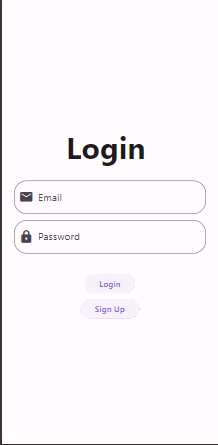
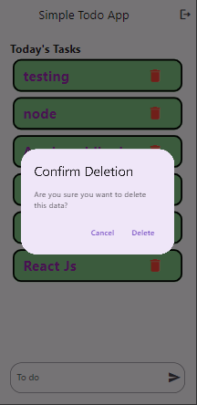
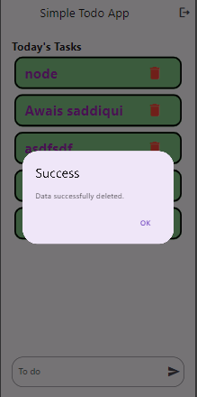

# Firebase and Flutter Configuration

## Step 01 Node.js Installation:

Download and Install node js frome <a href="https://nodejs.org/en/download">here</a> for npm and add to your system path.

## Step 02 Firebase Project Creation:
Create a Firebase project <a href="https://console.firebase.google.com/">Firebase Login </a>


## Step 03 Firebase CLI:
``` npm install -g firebase-tools ```

## Step 04  Installing FlutterFire CLI:

Install the FlutterFire CLI

```  dart pub global activate flutterfire_cli ```

## Step 05 Configuring Dependencies: 


```flutter pub add firebase_core```

```flutter pub add firebase_auth```

```flutter pub add cloud_firestore```

```flutter pub add provider```

```flutter pub add firebase_ui_auth```

## Step 06 Running

``` firebase login ```

## Step 07 Running
```  flutterfire configure ``` 
Try to use command prompt .


# Output 

## Todo App 

<!-- 



 -->

    
